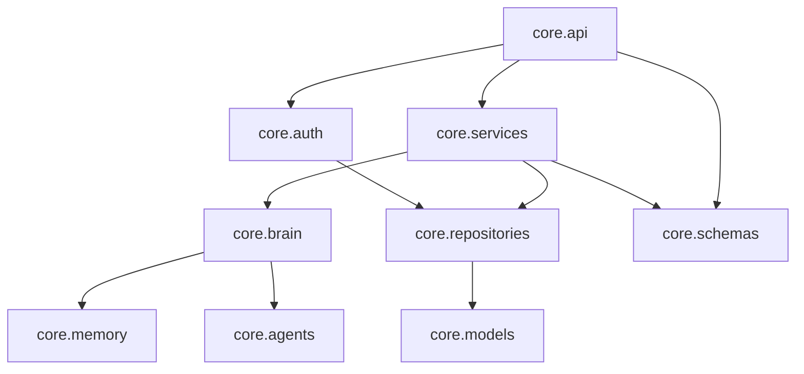

# Backend Dependency Graph

```mermaid
graph TD
    API[core.api] --> Services[core.services]
    Services --> DB[core.repositories]
    Services --> Brain[core.brain]
    Brain --> Memory[core.memory]
    Brain --> Agents[core.agents]
    API --> Schemas[core.schemas]
    Services --> Schemas
    DB --> Models[core.models]
    Auth[core.auth] --> DB
    API --> Auth
```

All circular dependencies have been eradicated by isolating SQL operations to `core.repositories` and business logic to `core.services`.
